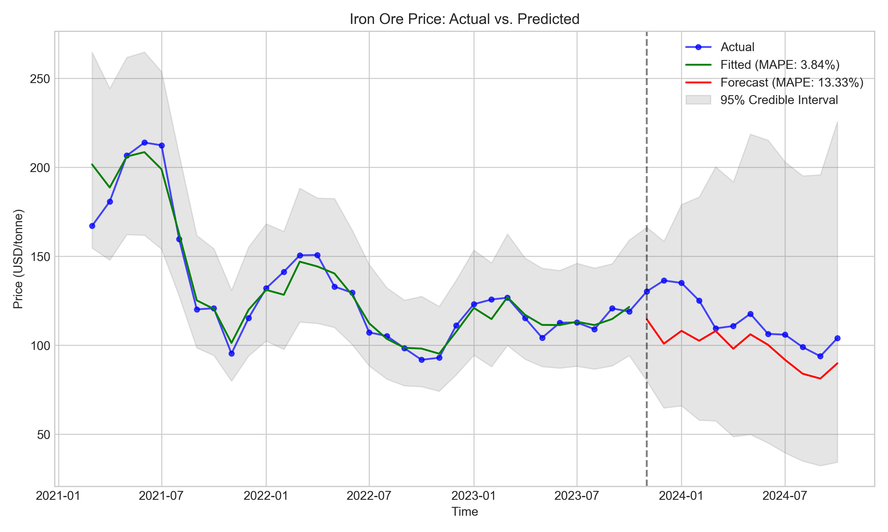
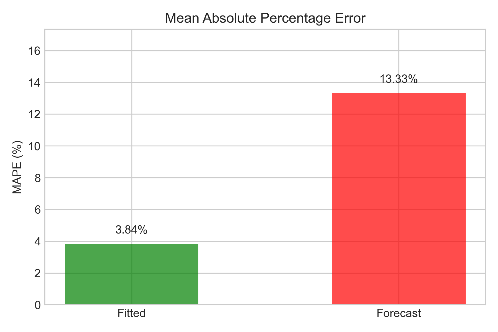
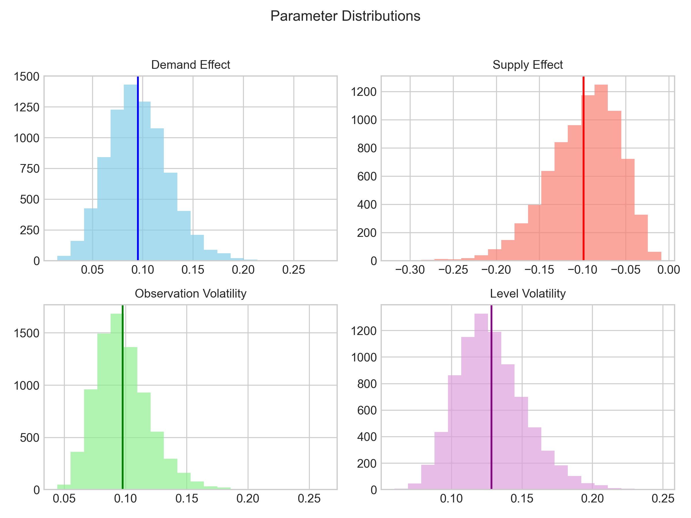
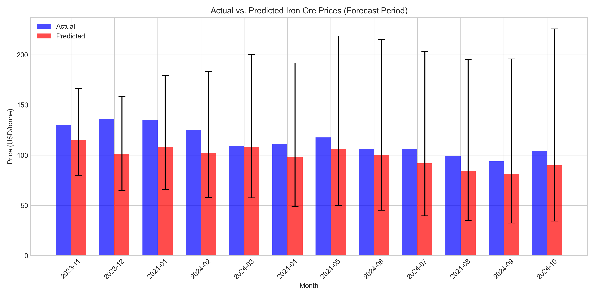
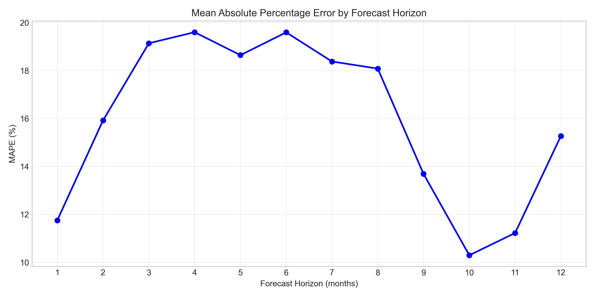
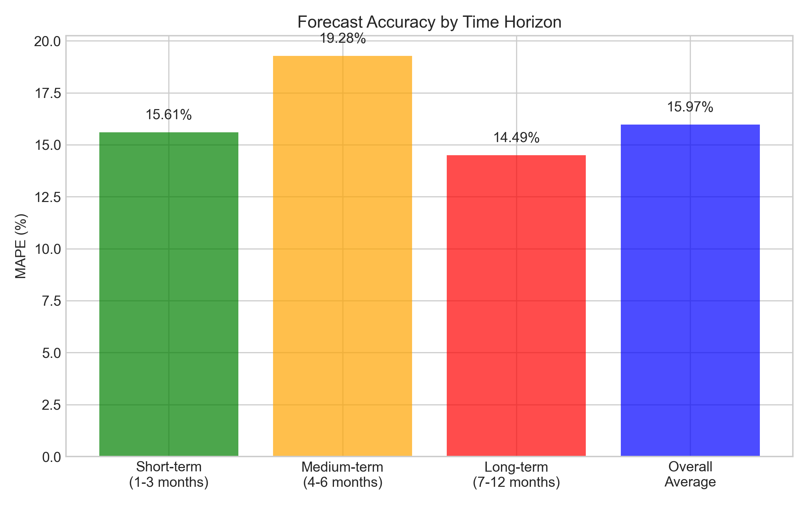

# Iron Ore Price Forecasting with Bayesian Dynamic Linear Model

This repository contains Python code for forecasting iron ore prices using a Bayesian Dynamic Linear Model (DLM) with supply and demand constraints. The model is implemented in Stan and fitted using CmdStanPy, providing a robust framework for time series analysis.

## Introduction

The goal of this project is to predict iron ore prices by modeling the effects of demand (global steel production) and supply (iron ore inventory) using a Bayesian approach. The DLM captures time series dynamics while enforcing economic constraints: demand increases prices, and supply decreases them.

## Data Sources

The analysis uses the following datasets, stored in the `iron-data/` directory:
- **Iron Ore Prices:** `iron_ore_price_processed.parquet` - Monthly prices of iron ore.
- **Iron Ore Production:** `iron_ore_production_countries.parquet` - Global iron ore production data.
- **Steel Production:** `industrial_data_processed.parquet` - Global steel production data.
- **Inventory:** `inventory.parquet` - Total iron ore inventory at 45 ports.
- **Futures Contracts:** `futures_contracts.parquet` - Iron ore futures prices.

## Data Preparation

The data is prepared as follows:
1. **Loading and Cleaning:**
   - Each dataset is loaded and filtered for relevant variables (e.g., global production).
2. **Merging:**
   - Datasets are merged on the `time` column into a single DataFrame.
3. **Transformations:**
   - Log transformations are applied to prices and other variables to stabilize variance.
   - Demand and supply variables are standardized (z-score normalization).
   - Month dummy variables are added for seasonality.
4. **Finalization:**
   - Missing values are removed to create the final dataset.

## Bayesian Model

The model is a Dynamic Linear Model (DLM) implemented in Stan (`dlm_supply_demand.stan`):

```stan
data {
  int<lower=1> T;              // Number of time points
  vector[T] y;                 // Observed time series (log price)
  vector[T] x_demand;          // Demand regressor (standardized)
  vector[T] x_supply;          // Supply regressor (standardized)
  int<lower=0> n_forecast;     // Number of forecast points
  int<lower=0, upper=T> n_obs; // Number of observed points
}
parameters {
  vector[T] level;             // Level component
  real beta_demand_raw;        // Raw demand effect
  real beta_supply_raw;        // Raw supply effect
  real<lower=0.01> sigma_obs;     // Observation error
  real<lower=0.01> sigma_level;   // Level evolution volatility
}
transformed parameters {
  real beta_demand = exp(beta_demand_raw);  // Positive demand effect
  real beta_supply = -exp(beta_supply_raw); // Negative supply effect
}
model {
  beta_demand_raw ~ normal(0, 1);
  beta_supply_raw ~ normal(0, 1);
  sigma_obs ~ normal(0.5, 0.5) T[0.01,];    // Half-normal with lower bound
  sigma_level ~ normal(0.5, 0.5) T[0.01,];  // Half-normal with lower bound
  
  level[1] ~ normal(y[1], sigma_obs);
  for (t in 2:T) {
    level[t] ~ normal(level[t-1], sigma_level);
    if (t <= n_obs) {
      y[t] ~ normal(level[t] + beta_demand * x_demand[t] + beta_supply * x_supply[t], sigma_obs);
    }
  }
}
generated quantities {
  vector[T] y_pred;
  for (t in 1:T) {
    y_pred[t] = normal_rng(level[t] + beta_demand * x_demand[t] + beta_supply * x_supply[t], sigma_obs);
  }
}
```

### Mathematical Formulation
- **Observation Equation:**  
  $y_t = \text{level}_t + \beta_{\text{demand}} \cdot x_{\text{demand}, t} + \beta_{\text{supply}} \cdot x_{\text{supply}, t} + \epsilon_t, \quad \epsilon_t \sim \mathcal{N}(0, \sigma_{\text{obs}}^2)$
  
- **State Evolution:**  
  $\text{level}_t = \text{level}_{t-1} + \eta_t, \quad \eta_t \sim \mathcal{N}(0, \sigma_{\text{level}}^2)$
  
- **Constraints:**  
  - $\beta_{\text{demand}} > 0$ (enforced via `exp()`)
  - $\beta_{\text{supply}} < 0$ (enforced via `-exp()`)

The model estimates the level component and regression coefficients while predicting future prices.

## Running the Code

1. **Requirements:**
   - Python 3.x
   - CmdStanPy (`pip install cmdstanpy`)
   - CmdStan (install via CmdStanPy instructions: [CmdStanPy Docs](https://cmdstanpy.readthedocs.io/en/stable/installation.html))
   - Pandas (`pip install pandas`)
   - NumPy (`pip install numpy`)
   - Matplotlib (`pip install matplotlib`)
   - Seaborn (`pip install seaborn`)

2. **Steps:**
   - Place the data files in `iron-data/`.
   - Run the script: `python iron_ore_forecast.py`.

## Results and Visualizations

The script generates the following plots:
1. **Time Series Forecast (`time_series_forecast.png`):**  
     
   Actual vs. predicted prices with 95% credible intervals.

2. **MAPE Comparison (`mape_comparison.png`):**  
     
   Bar chart comparing MAPE for fitted and forecast periods.

3. **Parameter Distributions (`parameter_distributions.png`):**  
     
   Histograms of posterior distributions for demand effect, supply effect, and volatilities.

4. **Forecast Bar Chart (`forecast_bar_chart.png`):**  
     
   Actual vs. predicted prices for the forecast period with error bars.

5. **MAPE by Horizon (`mape_by_horizon.png`):**  
     
   Line plot of MAPE across forecast horizons (1-12 months).

6. **MAPE by Range (`mape_by_range.png`):**  
     
   Bar chart of MAPE for short-term (1-3 months), medium-term (4-6 months), and long-term (7-12 months) forecasts.

## Cross-Validation

The model includes time series cross-validation to assess its predictive performance across different forecast horizons:

1. **Rolling Window Approach:**
   - The dataset is divided into training and test periods.
   - The model is fitted on incrementally larger training sets.
   - For each fit, forecasts are generated for horizons 1-12 months ahead.

2. **Performance Metrics:**
   - MAPE is calculated for each forecast horizon.
   - Results are aggregated to assess short, medium, and long-term forecasting accuracy.

3. **Adaptive Parameters:**
   - The cross-validation procedure automatically adjusts training window size if data is limited.
   - Error handling ensures robust results even with challenging datasets.

## Interpretation

- **Demand Effect:** Positive, indicating higher steel production increases prices.
- **Supply Effect:** Negative, showing higher inventory reduces prices.
- **Accuracy:** MAPE provides insight into model performance, with cross-validation assessing forecast reliability over different horizons.

## License

This project is licensed under the MIT License - see the LICENSE file for details.
